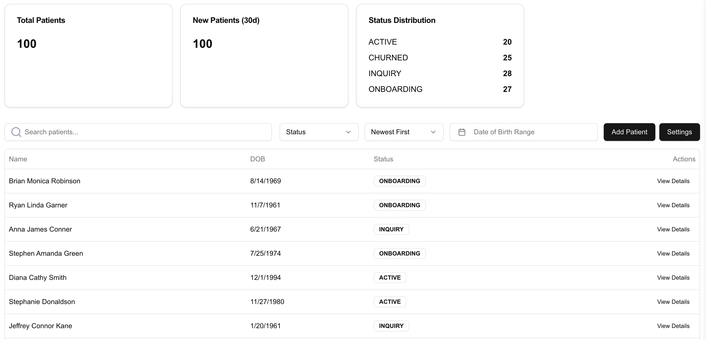
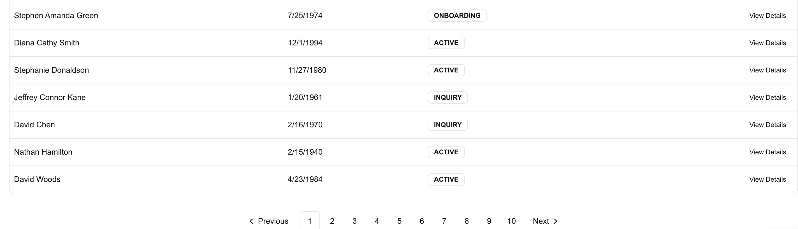
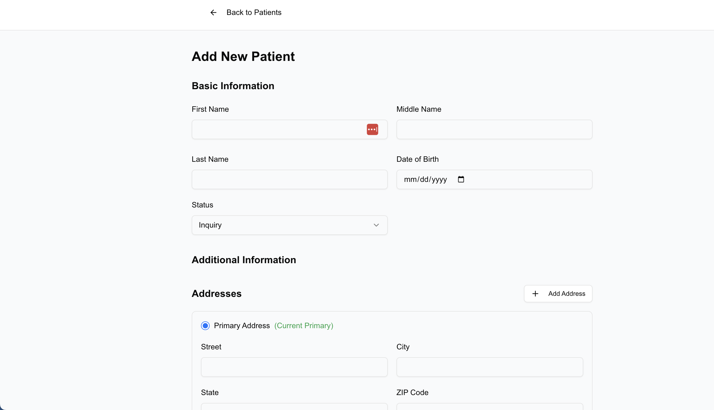
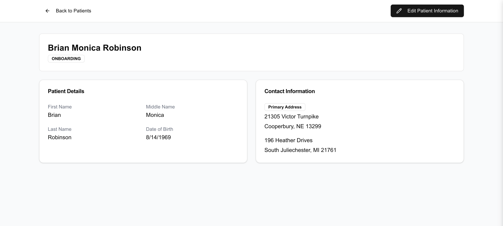
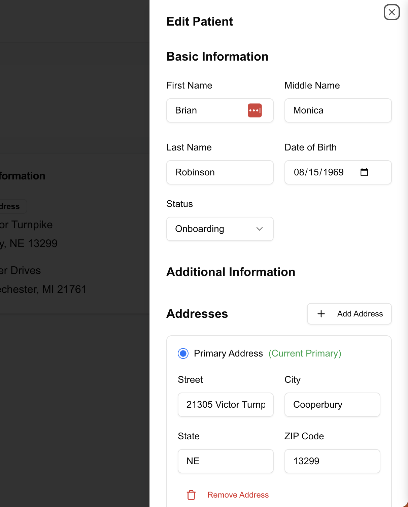
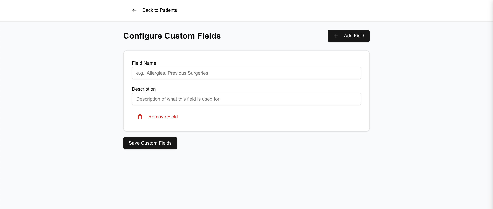

# provider-dashboard
 Provider dashboard to manage patient's critical data. Built using NextJS 13, shadecn/ui https://ui.shadcn.com/ and Django. Started using the framework django-admin with the intention of building authentication/login on top of it. Decided it would be best to go in another direction with that login implementation if I revisit this project again.

## Getting Started

### Client
npm run dev

## Server
python manage.py runserver